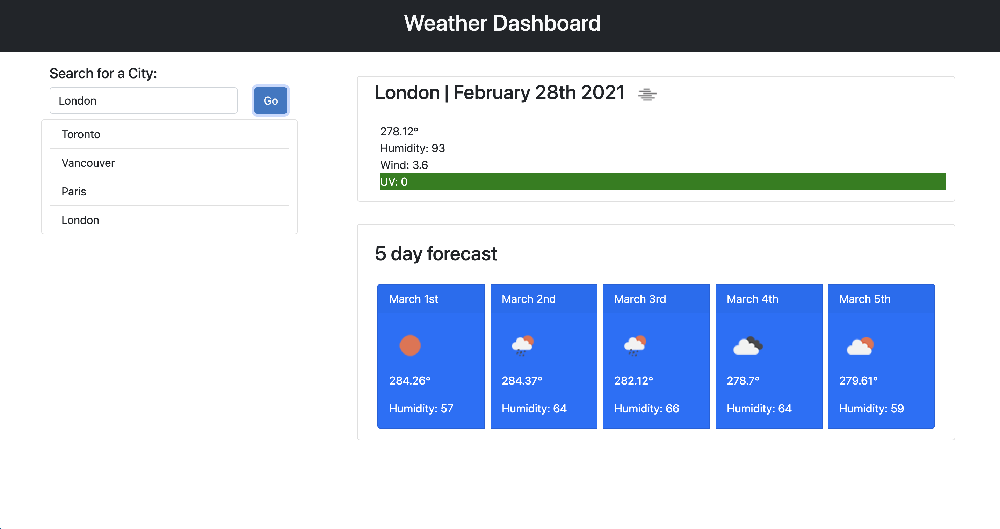

# Weather Dashboard
## Table of Contents: 
[Project Description](#Project-Description)  
[Installation](#Installation)  
[Usage Information](#Usage-Information)  
[Contribution Guidelines](#Contribution-Guidelines)  
[Test Instructions](#Test-Instructions)  
[Licensing](#Licensing)  
[Questions and Contact Information](#Questions-and-Contact-Information)  

## Project Description 
This application will load the weather for a given city when the user searches for that specific city. It will give the current weather, and the weather for the following 5 days. When the user searches for a city, the city is saved to local storage. The user can then click on the searched city to see its weather again. The layout is mobile and desktop friendly.

## Installation 
N/A

## Usage Information 
Search for a city in the top left search bar to see it's weather forecast.

## Contribution Guidelines 
N/A

## Test Instructions 
N/A

### Licensing 
MIT

### Questions and Contact Information 
Github: github.com/Alexgoldman98  
Github username: alexgoldman98   
Email address: alexgoldman98@gmail.com  
Any Questions should be directed to me using the above contact information.

### Screenshots

### Link to application
https://alexgoldman98.github.io/weatherDashboardHW6/